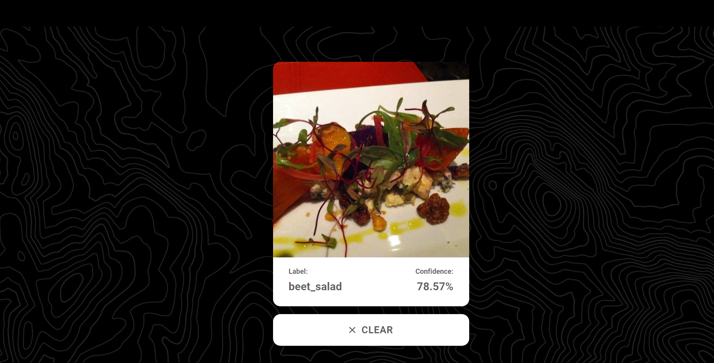

# Predict that Dish



## Objective

A Web Application that uses a trained Neural Network hosted by a server to predict the label of an input image sent by the client

## Architecture

Front End - ReactJS
Back End - Flask
Model - TensorFlow

# Client Side

## Setup for ReactJS

1. Install Nodejs ([Setup instructions](https://nodejs.org/en/download/package-manager/))
2. Install NPM ([Setup instructions](https://www.npmjs.com/get-npm))
3. Install dependencies

```bash
cd client
npm install --from-lock-json
npm audit fix
```

4. Change API url in `.env`.

## Running the client

1. Get inside `client` folder

```bash
cd client
```

2. Update `REACT_APP_API_URL` to API URL if needed in `.env`.
3. Run the frontend

```bash
npm run start
```

# Server Side

## Flask Web App Setup & Installtion

Make sure you have the latest version of Python installed.

## Running The App

```bash
python server.py
```
